# Magasinet Ekorren


This website was created for a company called Magasinet Ekorren ('The Squirrel Warehouse' roughly translated from Swedish to English). 
The company provides storage units in various sizes for rent to persons and businesses. The website provides short and concise information about the storage units and how to rent them. It provides a service for creating an account, and managing the orders and customer information on a user panel page. 
There is also an admin panel where the site owner can manage the database and collect an updated customer registry.

The website can be [found here](https://magasinet-ekorren.herokuapp.com/).

## Table of Contents

- [UX and UI](#ux-and-ui)
  - [Site Owner Goals](#site-owner-goals)
  - [User Stories](#user-stories)
  - [Wireframes](#wireframes)
- [Design](#design)
  - [Imagery](#imagery)
      -[Logo](#logo)
      -[Hero image](#hero-image)
      -[Why us section](#why-us-section)
  - [Colours](#colours)
  - [Fonts](#fonts)
  - [Favicon](#favicon)
- [Features](#features)
  - [Header](#header)
  - [Carousel](#carousel)
  - [All Sections](#all-sections)
  - [About Section](#about-section)
  - [Media Section](#media-section)
  - [Events Section](#events-section)
  - [Contact Section](#contact-section)
  - [Footer](#footer)
- [Deployment](#deployment)
- [Testing](#testing)
  - [Validator Testing](#validator-testing)
  - [Manual Testing](#validator-testing)
  - [Bugs](#bugs)
- [Credits](#credits)
  - [Languages](#languages)
  - [Frameworks, Libraries and Tools](#frameworks-libraries-and-tools)
  - [Images](#images)
  - [Content](#content)

#

## UX and UI

- ### Site Owner Goals

  The website was developed together with the site owner to ensure the main goals of the site was met:

  - Provide information as a marketing tool to get new customers
  - Let the customer rent a storage unit online
  - Present information in a professional and accessible way
  - Ease process of updating the customer database for the product owners invoice program
  - Deploy automated emails for confirmation and notification to the customer and the product owner

#

- ### User Stories

Agile development practices such as user stories were managed by using GitHub's "Issues" tab in the GitHub repository.

The GitHub project can be accessed [here](https://github.com/users/Johneriksson88/projects/4/views/1).
The Issues page can be acceessed [here](https://github.com/Johneriksson88/ekorren/issues)

User stories were divided into three categories:

  - Visitor - a prospective customer enquiring information to make a decision to rent a storage unit
  - Customer - a customer which has decided to rent a storage unit from Magasinet Ekorren
  - Admin - the site owner

  - #### Visitor Goals

    [1](https://github.com/Johneriksson88/ekorren/issues/3). As a visitor I can access information about contact, directions and practical information so that I can learn more about the company, their products and how to get in touch with them.

    [2](https://github.com/Johneriksson88/ekorren/issues/2). As a visitor I can see arguments for why I would want to rent a storage unit from Magasinet Ekorren so that I can make a decision to rent or not to rent a storage unit.

    [3](https://github.com/Johneriksson88/ekorren/issues/1). As a visitor I can access information about the different products and their prices so that I can make a decision to rent or not rent a storage unit.

  - #### Customer Goals

    [1](https://github.com/Johneriksson88/ekorren/issues/14). As a customer/visitor I can get clear messages on top of the page so that I get feedback on what I've done.
    [2](https://github.com/Johneriksson88/ekorren/issues/11). As a customer I can view my orders so that I know what and how many storage units I'm renting.
    [3](https://github.com/Johneriksson88/ekorren/issues/10). As a customer I can edit my contact information so that my contact and invoice details are up to date.
    [4](https://github.com/Johneriksson88/ekorren/issues/9). As a customer I can delete orders so that I can cancel my rental of storage unit/units.
    [5](https://github.com/Johneriksson88/ekorren/issues/8). As a customer I can delete my account so that I can choose not to be a customer any more.
    [6](https://github.com/Johneriksson88/ekorren/issues/5). As a customer I can register an account so that I can update my information and manage/make new orders.
    [7](https://github.com/Johneriksson88/ekorren/issues/4). As a customer I can rent a storage unit directly from the web site so that I can quickly act on my decision to rent a storage unit from Magasinet Ekorren.

  - #### Admin goals

    [1](https://github.com/Johneriksson88/ekorren/issues/7). As an admin I can login to an admin account so that I can access the admin panel.
    [2](https://github.com/Johneriksson88/ekorren/issues/12). As an admin I can get an email notification when a new order is submitted so that I can manually process it.
    [3](https://github.com/Johneriksson88/ekorren/issues/13). As an admin I can get an email notification when an order is deleted so that I can cancel the invoicing for that order.
    [4](https://github.com/Johneriksson88/ekorren/issues/6). As an admin I can download the customer registry so that I can view it and import it to my invoice software.

  #

  ## Wireframes

  The wireframes for this site were created using Balasmiq. The end product ended up a little bit different from the original wireframe, due to considerations and ideas changing as the creative process flowed on. I only made a wireframe for the landing page, as to get a big picture feel of how the website should look and feel.

  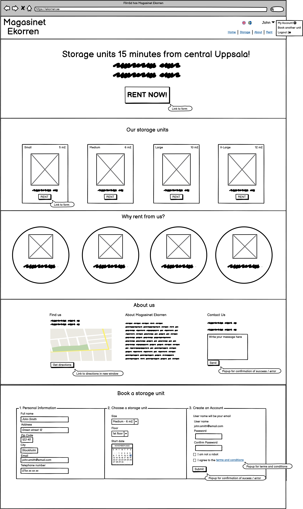


## Design

- ## Imagery

  - ### Logo
    The company logo in the left part of the header has an acorn icon from [flaticon.com](https://www.flaticon.com/). Since the squirrel ('ekorre' in Swedish) is part of the company name, and it repesents the nature of storing and collecting things in one place (think of a squirrel gathering acorns), the acorn felt appropriate for part of the logo. It was the lowest common denominator between the business (storage) and the name (ekorre) and felt natural.
  - ### Hero image
      The hero image of cardboard boxes were purchased from [shutterstock](https://www.shutterstock.com/). They are supposed to represent the nature of storing things in boxes, and provide a fairly uniform color without taking up too much visual capital. This image was the closest option to having a monocolor or gradient background, but with the benefit of having appropriate objects for the business.
  - ### Product cards
      The images for the product cards on the landing page was purchased from [shutterstock](https://www.shutterstock.com/). They are possibly temporary as the site owner wanted to create more personal image representations of the different sizes storage units themselves, but has not done so yet.
  - ### Why us section
      The "why us" section contains 4 icons from [flaticon.com](https://www.flaticon.com/). They were chosen to visually represent the 4 given benefits of renting a storage unit from Magasinet Ekorren. If a visitor were to quickly scroll through the page, the icons being circled to give a badge-like appearance catches the visitor eye and tells a clear story of why Magasinet Ekorren would benefit them.


- ## Colours

  From the start the colors were picked from a squirrel themed palette i found [here](https://colorpalettes.net/tag/colour-of-squirrel-coat/) to represent the colors of the squirrel. At the end of the project when doing the lighthouse testing, I realized that the contrasts using these colors did not pass through the availabilaty-test. After playing around with the Chrome developer tools for testing contrast and availability, i found completely different colors that felt modern, fresh and most of all accessable to the visually impaired and color blind. So essentially accessability dictated the color choices of the entire website.

  Inspiration for color choices can come from a million different places, and I think this shows that a simple thing as playing around with an accessability tool can work at least as well as looking at a color palette.

  To separate the sections on the landing page i chose to have every other section (Get started and Why rent from us) have a contrasting background color of #74cfbf to the other white ones. I did this to clearly signal that the visitor is looking at another section.

- ## Fonts

  The fonts Cinzel Decorative, Bevan and Lato were chosen from the options available from Google Fonts.

  [Cinzel Decorative](https://fonts.google.com/specimen/Cinzel+Decorative?query=cinzel) is only used for the company logo in the header. I thought it looked elegant, modern and the wavy swirls of the capital "M" in "Magasinet" looked almost like a squirrels tail.

  [Bevan](https://fonts.google.com/specimen/Bevan?query=bevan) was chosen for the headings. It is a bold display font that i think clearly defines a new section of the page with its boldness and thickness.

  [Lato](https://fonts.google.com/specimen/Lato?query=lato) was the given choice for all the body text. It is a very popular and familiar font for people browsing the web. The description says: "The semi-rounded details of the letters give Lato a feeling of warmth, while the strong structure provides stability and seriousness", and i felt that these keywords jived with the website as a whole.

- ## Favicon

  The favicon is the same icon as in the logo, and was the clear candidate for representing Magasinet Ekorren as explained in the [logo](#logo) paragraph.

  

## Features

- ## Header

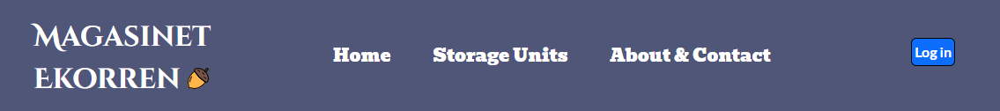

- The header consists of a [bootstrap component](https://getbootstrap.com/docs/4.0/components/navbar/) which is slightly modified to fit the logo, navbar and login/logout and account related links.
- The navbar has a fixed position at the head of the page which sits above all other content. This was chosen over a sticky position mainly for browers compatibility, but it's function does not vary in any significant way to a fixed position.
- The header is fully responsive and collapses the three navbar links and instead shows a clickable "hamburger menu" for viewport widths of 991px and smaller.

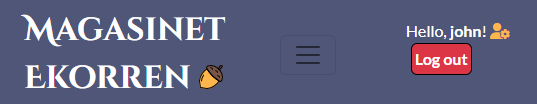

- ### Logo
    - The logo is described [here](#logo).

- ### Navigation links
    - There are 3 main navigation links:
      - **Home** - leads to the top of the landing page.
      - **Storage Units** - leads to the product cards section on the landing page.
      - **About & Contact** - leads to the About & Contact section on the landing page.
    

    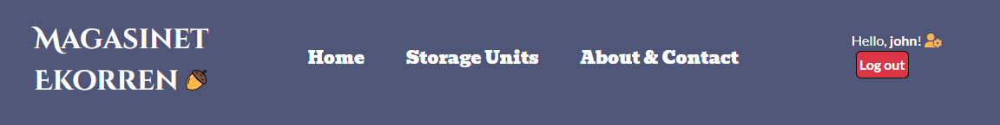

    - On the right of the header are the dynamic login and account related links.
      - **Log in** - This button is showed only if a user is _not_ logged in, and leads to the login page.
      - **Log out** - This button is showed only if a user _is_ logged in and logs out the user and redirects to the landing page.
      - **Hello, _username_** - This is a dynamic message which greets the user and tells them they are logged in. It is only showed if a user is logged in.
      -  **User panel icon** - This is the link to get to the user panel. It is only showed if a user is logged in.
      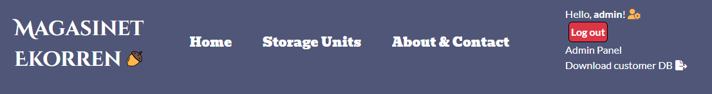
      - **Admin panel** - This is a link to the Django admin panel, where the admin can manage the database. This is only showed if a superuser is logged in.
      - **Download Customer DB** - This is a direct download link that downloads the current customer database in a CSV-file format. This is only showed if a superuser is logged in.

#

- ## Messages

  - Directly below the header is a hidden div for messages. Here the user gets feedback when for example an account has been created, an order has been made or deleted. The message div is a part of the base template, hence it will show on whatever page the user is. The message dissappears after 5 seconds, coded with some custom JavaScript.
  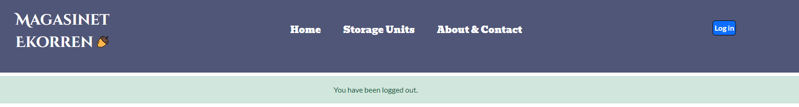

#

- ## Lead

  - Below the header and eventual messages is a lead paragraph. This space is reserved to display offers to the visitor with the intent to catch their interest in making a decision to rent a storage unit. The lead has a contrasting background color of #f7ba5b to pop out between the header and hero section.

#

- ## Hero Section

  - The hero section is designed to quickly communicate what Magasinet Ekorren is about. The "Rent now"-button is a call to action so the visitor quickly can get to business renting a storage unit. At the bottom is a lead paragraph with the starting price highlighted by green, which communicates the competative prices that Magasinet Ekorren actually has.
  - The hero image is described [here](#hero-image).

  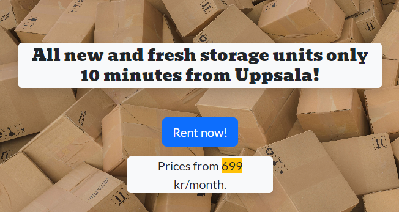

  #

- ## Instructions section 

  - The Instructions section is intended to show the visitor how easy it would be for them to go ahead and rent a storage unit from Magasinet Ekorren. 
  - Originally there were six steps, but after some feedback from friends i narrowed it down to three to emphasize how simple it is. 
  - As with most of the landing page, this section further informs the visitor and helps them towards a decision.
  - This section has a contrasting background color to the two adjacent sections to help separate them.
  - On bigger screens the list is displayed inline, and on smaller screens the list items are stacked vertically.

  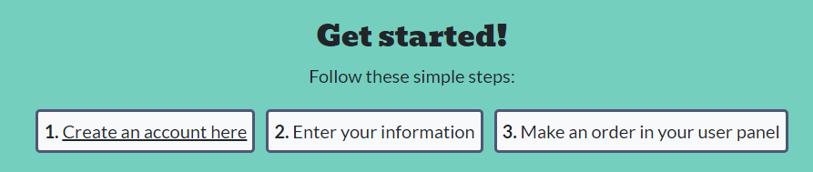

  #

- ## Product cards section

  - The product cards section is designed to clearly inform the visitor of the four different products that are available to them.
  - Every card has a header, a corresponding image to the size of the storage unit, information about size and price, and lastly a button which calls to action with the text "Rent now".
  - The "Rent now"-button leads to the order form if a user is logged in, or the login page if no user is logged in.
  - The images are explained [here](#product-cards)
  - The cards fluently follows the screen widths, moving cards down a row, from four on one row on bigger screens, down to one on each row on the smallest screens.

  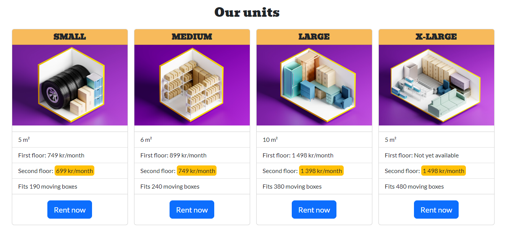

  #

- ## Why us section

  - The Why us section is there to give the visitor four reasons why they would want to rent a storage unit from Magasinet Ekorren.
  - It is designed to quickly catch the eye of the visitor, without having too much text that could cause them to scroll by it.
  - Like the instructions section, it has a contrasting background color to separate it from its adjacent sections.
  - The images is explained [here](#why-us-section)
  - The "badges" follows screen widths from all on one row on bigger screens, two on two rows on medium screens, and lastly one on each row on smaller screens.

  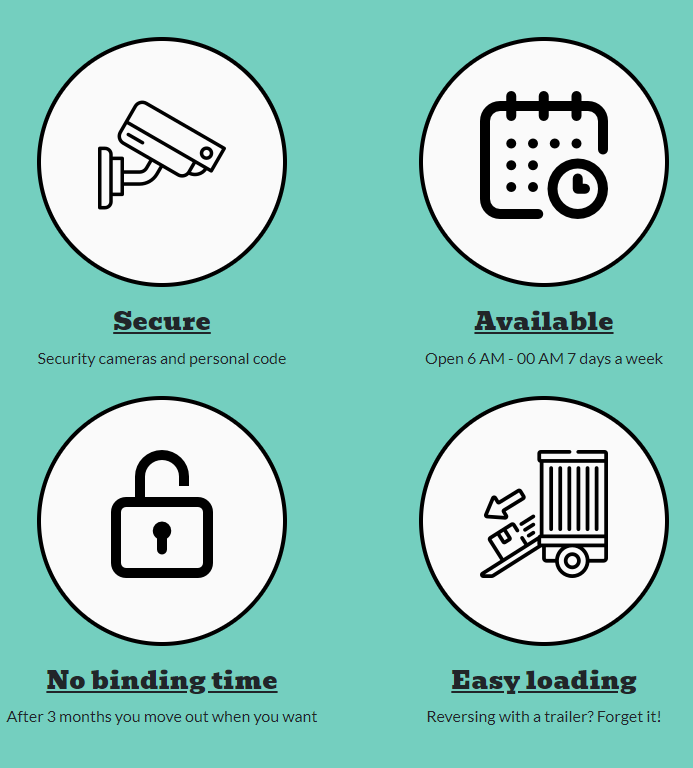

  #

- ## About & Contact section

  - The decision to include the Find us, About and Contact sections into one was for the navbar to have a minimum number of links. Having only three links decreases cluttering and looks less confusing to the visitor. Since the three sections are higly related i saw no problem in collecting them into one section.
  - The three sections are vertically stacked on all viewport widths and divided into cards with a rounded edge and a shadow, to have them appear to float on the page. This way they stick out from the white background and look easier on the eye.

  - ### Find us
    - The Find us header has a map icon from [fontawesome](https://fontawesome.com/) which visually reinforces what the section presents.
    - The map is an embedded google map, with a link to quickly get directions to the storage unit facility.
    - The iframe element has the attribute of 'loading="lazy"' to force it to load once the visitor scrolls down to it, as opposed to when the whole page loads.

  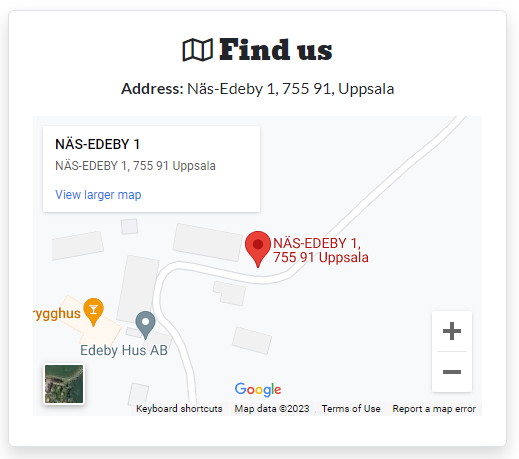

  - ### About us
    - The About us section header has an information "i" icon to represent that the visitor can find information about the company here.
    - The text is a short presentation of the company, their values and a short paragraph about the storage units.
    
  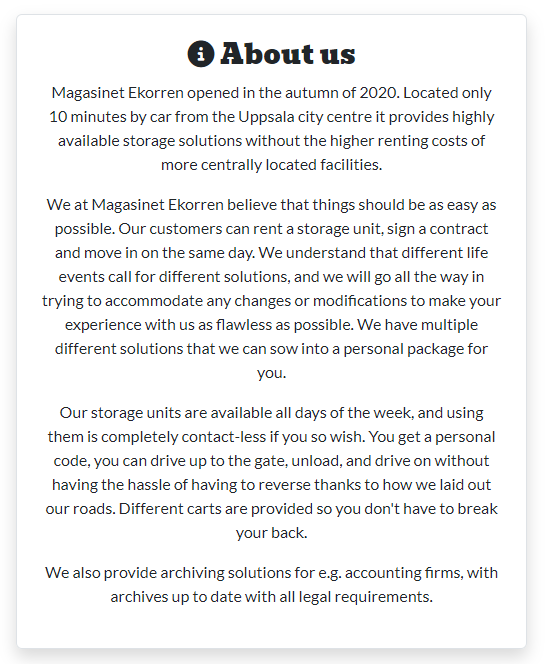

#

- ## Footer

  - The Footer is divided into three parts:
    - Copyright text on the left with a script updating the year to the current one.
    - An acorn in the middle to give it some color and wrap the end of the page nicely.
    - Navigation links to the right with an added link to register if the visitor is not logged in or to the user panel if the user is logged in.
  - The footer is fixed to the bottom of the viewheight window by means of the bootstrap "fixed-bottom" class.
  - It has the same background color of #505677 as the header to create continuity in the design.

  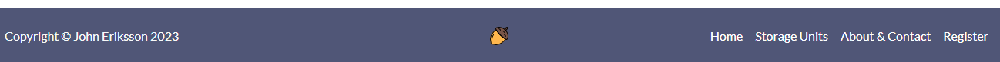

#

## Technology

This section covers all technology components and choices.

### Technology Choices

- [GitHub](https://github.com/)
	- version control and hosting during development
- [GitPod](https://gitpod.io/)
  - in-browser editor
- [HTML 5.2](https://www.w3.org/TR/html52/)
	- to create the content.
- [Bootstrap 5.2.2](https://getbootstrap.com/)
	- to style the content, provide the layout and some JavaScript functionality
- [jQuery 3.6.0](https://jquery.com/)
  - to manipulate the DOM.
- [CSS 3](https://www.w3schools.com/css/default.asp)
  - additional styling and layout.
- [Django 4.1.3](https://docs.djangoproject.com/en/4.1/)
  - the main bulk of the project used Djangos Python-based built-in features.
- [Python](https://www.python.org/)
	- an interpreted, high-level, and general-purpose programming language.
- [Code Institute GitPod Full Template](https://github.com/Code-Institute-Org/gitpod-full-template)
	- the template i started my project with.
- [Cloudinary](https://cloudinary.com/)
  - a cloud storage service that i used for static files and images
- [Jinja 3.1 ](https://jinja.palletsprojects.com/en/3.1.x/)
	- to be able to write Python code mixed with the HTML
- [GitHub](https://github.com/)
	- project repository.
- [Heroku](https://heroku.com/)
	- for deployment and hosting.
- [Balsamiq](https://balsamiq.com/wireframes/)
  - to create the wireframe
- [Lucidchart](https://www.lucidchart.com/)
  - to create a flowchart
- [Autopep8](https://pypi.org/project/autopep8/)
  - to correctly format all Python code.
- [ElephantSQL](https://www.elephantsql.com/)
  - database hosting.


#

## Deployment

### Deployment to heroku

**In your terminal** 

1. Add the list of requirements by running the command "pip3 freeze --local > requirements.txt"
2. Git add and git commit the changes made

**Log into heroku**

3. Log into [Heroku](https://dashboard.heroku.com/apps) or create a new account and log in

4. In the top right-hand corner click "New" and choose the option Create new app, if you are a new user, the "Create new app" button will appear in the middle of the screen

5. Write app name - it has to be unique
6. Choose Region
7. Click "Create App"

**The page of your project opens.**

8. **IMPORTANT** - Make sure all secret keys and passwords are kept in an env.py file in your root directory. 
  Access them by using e.g.: 
  ```
  os.environ.get('SECRET_KEY')
  ```

9. Click "Settings" from the menu on the top of the page

10. Go to section "Config Vars" and click button "Reveal Config Vars". 

11. Add the below variables to the list

    * DATABASE_URL as provided by ElephantSQL
    * SECRET_KEY is the django secret key and can be generated [here](https://miniwebtool.com/django-secret-key-generator/). 
    * Cloudinary URL can be obtained from [cloudinary](https://cloudinary.com/). Follow the steps on the website to register. 

**Go back to your code**

12. Procfile needs to be created in your app and contain:
```
web: gunicorn PROJECT_NAME.wsgi
```

13. In settings in your base app add the Heroku URL to ALLOWED_HOSTS

14. Add and commit the changes in your code and push to github

**Final step - deployment**

15. Next go to "Deploy" in the menu bar on the top 

16. Go to section "deployment method", choose "GitHub"

17. New section will appear "Connect to GitHub" - Search for the repository to connect to

18. Type the name of your repository and click "search"

19. Once Heroku finds your repository - click "connect"

20. Scroll down to the section "Automatic Deploys"

21. Click "Enable automatic deploys" or choose "Deploy branch" and manually deploy

22. Click "Deploy branch"

Once the program runs you should see the message "the app was sussesfully deployed".


### Deployment problems

Initially deploying served some problems. A big one was that my static files didn't load. This is because i didn't have initial serving of the static files.
After using [this](https://dev.to/successhycenth/uploading-images-to-cloudinary-storage-from-a-django-drf-application-c40) guide i got it to work.

Another hassle during development was that i got this browser error every now and then:
```
Forbidden (403) CSRF verification failed. Request aborted.
```

Django requires CSRF-tokens (Cross Site Request Forgery) in their forms as a security measure to safely handle requests. Read more on CSRF [here](https://docs.djangoproject.com/en/4.1/ref/csrf/).
In the django settings.py-file you need to explicitly state trusted origins for unsafe requests (e.g POST).
In local development my URL changed day by day (e.g. https://8000-johneriksson88-ekorren-us6khvjs3ar.ws-eu83.gitpod.io/), and when testing my forms and submitting, I was presented with the error above. I soon learned that i had to change the CSRF_TRUSTED_ORIGINS settings variable as my URL changed. 


#

## Testing

- ## Validator Testing

The website was tested using the tools made available by the [World Wide Web Consortium](https://www.w3.org/), also known as "W3C".

The two tools used were the [Markup Validation Service](https://validator.w3.org/#validate_by_uri) and the [CSS Validation Service](https://jigsaw.w3.org/css-validator/#validate_by_uri).

In using the "Validate by URI" function in the HTML validator, I found that the validator was throwing errors related to the jinja templating language mixed with the HTML (for example for and if statements as ""). The solution i found was to open the page in a browser, righ click anywhere on the page and press "Check page source", and copying the output HTML directly from there and put it in the "Validate by Direct Input"  function. This way i get the fully rendered HTML without the jinja template tags.

No errors were returned for all HTML or CSS across all tests.

 <details>
  <summary>HTML Validation by URL</summary>


  </details>
 <details>
  <summary>HTML Validation by Direct Input</summary>


  </details>

  <details>
  <summary>CSS Validation by URL</summary>


  </details>
 <details>
  <summary>CSS Validation by Direct Input</summary>


  </details>

#

- ## Manual Testing

  The site was tested manually across a range of devices to ensure all links and styling work correctly and to ensure responsiveness across a range of devices. All features on the page were tested, especially the form validation, to ensure user feedback worked properly and no faulty inputs could be made. Testing was carried out on multiple browsers such as Google Chrome, Microsoft Edge, Mozilla Firefox, Safari and Opera. Testing was carried out on an Apple iPhone 12, Apple iPhone 13, Huawei P20, iPad Mini and Windows 10 Desktops.

  The website was also tested in Internet Explorer 11, where some performance and layout issues are present. I was unable to resolve these as Internet Explorer 11 is not supported by Bootstrap 5.

  #

  - ## Lighthouse Testing

  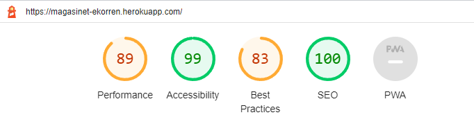

  A test was ran using Lighthouse within Google Chrome to verify performance and accessibility standards were met and to ensure best practices were followed.

  The following steps were done to improve the score on the Lighthouse test:

    - Contrasting text and background colors were altered until complying with AAA-standars, with help from Google Dev Tools for maximum readability.
    - Images were compressed by using [TinyPNG](https://tinypng.com/).
    - The 'loading = "lazy"' attribute was added to all images, to get them to load when they are scrolled down to, instead of them all loading when the page initially loads.

  The full report can be viewed [here](main/static/readme/lighthouse_expanded.pdf).

  #

  - ## Wave Testing

  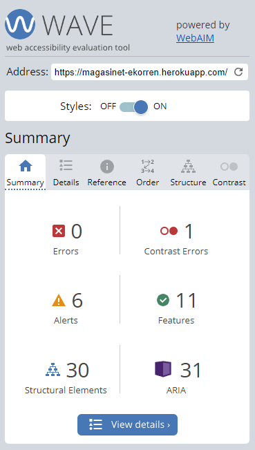

  A further test was ran using the Web Accessibility Evaluation Tool (WAVE) to ensure no errors were returned and to verify that no constrast issues existed on the site. This was an important step to ensure that users with disabilities were not negatively impacted by the design of the site and that the relevant standards have been met.

  The contrast warning seemed to be a bug in the validator, since i could not find the element where the warning occurred. 

  #

- ## Bugs

  - ## Section Header obscured on page scrolling

    A bug was discovered that resulted in the header of a section being obscured if the user clicked a link on the navbar. On clicking the link, the page would scroll, but it did not account for the space taken up by the navbar itself, obscuring the header as seen in the image below.

    

    Research was carried out on this bug and a resolution was found in an existing CSS property on the documentation made available on the [Mozilla MDN Web Docs website](https://developer.mozilla.org/en-US/docs/Web/CSS/scroll-margin-top).

    The below code was added to the ID tags of each link and was used to define the scroll snap area on each section of the page. Adding this code resolved this issue as seen in the below image.

    Code used to resolve display issue:

    ```
    scroll-margin-top: 3.7rem;
    ```

    

## Credits

- ## Languages

  - [HTML5](https://en.wikipedia.org/wiki/HTML5)
  - [CSS](https://en.wikipedia.org/wiki/CSS)
  - [Javascript](https://en.wikipedia.org/wiki/JavaScript)

- ## Frameworks, Libraries and Tools

  - [Am I Responsive](http://ami.responsivedesign.is/) - Used to verify responsiveness of website on different devices.
  - [Balsamiq](https://balsamiq.com/) - Used to generate Wireframe images.
  - [Bootstrap](https://getbootstrap.com/) - Main framework used for the site, with a focus on responsiveness.
  - [Chrome Dev Tools](https://developer.chrome.com/docs/devtools/) - Used for overall development and tweaking, including testing responsiveness and performance.
  - [Colour Contrast Analyser](https://www.tpgi.com/color-contrast-checker/) - Used to check colour contrast to ensure usability for users with visual impairements.
  - [Favicon.io](https://favicon.io) - Used to generate Favicon image.
  - [Font Awesome](https://fontawesome.com/) - Used for Social Media icons in footer.
  - [GitHub](https://github.com/) - Used for version control and hosting.
  - [Google Fonts](https://fonts.google.com/) - Used to import and alter fonts on the page.
  - [JQuery](https://en.wikipedia.org/wiki/JQuery) - Used to override default submit functionality and display modal instead.
  - [LambdaTest](https://www.lambdatest.com/) - Used for Cross Site Browser Testing.
  - [Lite-Server](https://www.npmjs.com/package/lite-server) - Used to host website locally to aid testing before updates were commited to GitHub.
  - [Prettier](https://marketplace.visualstudio.com/items?itemName=esbenp.prettier-vscode) - Used for consistent code formatting.
  - [Sass](https://sass-lang.com/) - Used to override existing Bootstrap variables to enhance readability.
  - [Slack](https://slack.com/) - Used for support and advice from the Code Insitute Community.
  - [TinyPNG](https://tinypng.com/) - Used to compress images to reduce filesize without a reduction in quality.
  - [Visual Studio Code](https://code.visualstudio.com/) - Application used for development of this site.
  - [W3C](https://www.w3.org/) - Used for HTML & CSS Validation.
  - [WAVE](https://wave.webaim.org/) - Used for Accessibility evaluation.

- ## Images

  - [The Jet Reds](https://www.thejetreds.co.uk/)

    - The Jet Reds Logo
    - Album Artwork
    - Single Artwork

  #

  - [Sop Rodchenvko](https://www.soprodchenvko.com/)

    - About Section Image
    - Event Section Background

  #

  - [Dave Thompson Imaging](https://www.facebook.com/DaveThompsonImaging)

    - Carousel Images

  #

- ## Content

  - As this site is based on a real band, some content on this site is based on content from the band, with permission. The content used is as follows:

    - The non-photographic content displayed is taken from the band themselves and is the artwork used on their single and album releases.
    - All photos are real photographs of the band. Details of the photographers is listed in the [Images](#images) section.
    - The text content of the 'What We Do', 'Latest Single' & Latest Album' sections are descriptions written by the band themselves and are featured on [the bands website](https://www.thejetreds.co.uk/).

  - The gig venues listed in the Events section are all real venues, but the dates and times of the events are all fictional.